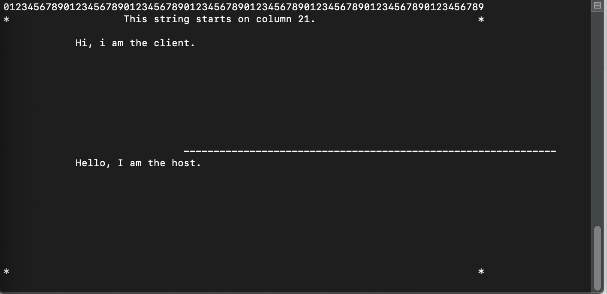
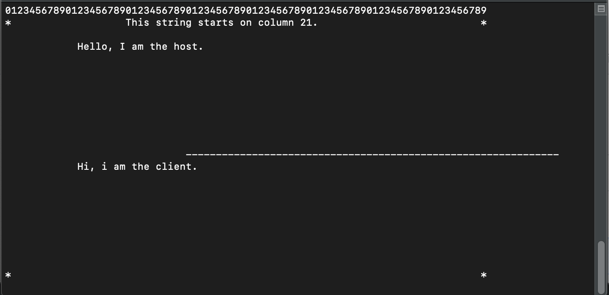

# Linux Talk
Acts just like the UNIX Talk.

# Setup
1. Run the makefile by typing `make`
2. run `./server.x` to start the host client.
3. run `./client.x [IP]` where `[IP]` is your local ip.

## Host's View

## Client's View

